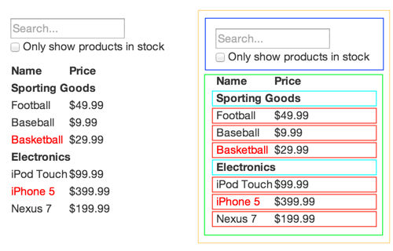

<header class="caption">

# Dojo ReactJS

André Filipe Goulart, Desenvolvedor Front-end Submarino.

</header>

<section class="slide cover" id="Cover">

## React JS

by [André Filipe Goulart](http://afgoulart.com)

</section>

<section class="slide">

## Tópicos que vamos abordar

1.  Conceitos
2.  Anatomia de uma aplicação React
3.  Renderização
4.  Componentes
5.  Props
6.  Estado
7.  Composição
8.  Por que usar React?

</section>

<section class="slide cover picture">

## Vamos começar?

</section>

<section class="slide cover picture full">

## Conceitos

</section>

<section class="slide">

## Elementos React

<figure>

> Objetos Javascript que representam elementos html guardados

</figure>

</section>

<section class="slide">

## Componentes

<figure>

> São criados pelo desenvoledor. Geralmente partes maiores que possuem uma estrutura e funcionalidades como Header, Footer, Main e Nav.

</figure>

</section>

<section class="slide">

## JSX

<figure>

> Técnica para criação dos elementos e componentes React.
> 
> Ex:
> 
> <pre class="language-html" data-lang="HTML">            `<h1>Oi</h1>`</pre>
> 
> Ex:
> 
> <pre class="language-jsx" data-lang="JS">            `React.createElement('h1', null, 'Oi');`</pre>

</figure>

</section>

<section class="slide">

## Virtual DOM

<figure>

> A arvore em javascript dos elementos e componetes React.
> 
> O React renderia o Virtual DOM para tornar a inteface do usuário visível.
> 
> O React observa procurando alterações, automaticamente mutando o DOM do browser para corresponder com o virtual DOM.

</figure>

</section>

<section class="slide shout active full textlight texttop">

## Anatomia de uma aplicação React

</section>

<section class="slide shout active full textlight topic">

## Anatomia de uma aplicação React

</section>

<section class="slide">

## Renderização

Aceita dois argumentos "elemento" e "um nó" do DOM

<pre class="language-jsx" data-lang="JSX">        `React.render(` `,` `document.body``);`</pre>

</section>

<section class="slide">

## Componente

Criando um componente

<pre class="language-jsx" data-lang="JSX">        `var MyFigure = React.createClass({` `render: function() {` `return ` `}``});``React.render(<MyFigure />, document.body);`</pre>

</section>

<section class="slide">

## Props

Criando um componente com propriedades

<pre class="language-jsx" data-lang="JSX">        `var MyFigure = React.createClass({` `render: function() {` `return (` `<figure>` `` `<figcaption>{this.props.caption} </figcaption>` `</figure>` `)` `}``});``React.render(<MyFigure imageUrl="http://tinyurl.com/lkevsb9" caption="My figure 1" />,` `document.body);`</pre>

</section>

<section class="slide shout" id="SeeMore">

## Obrigado

</section>